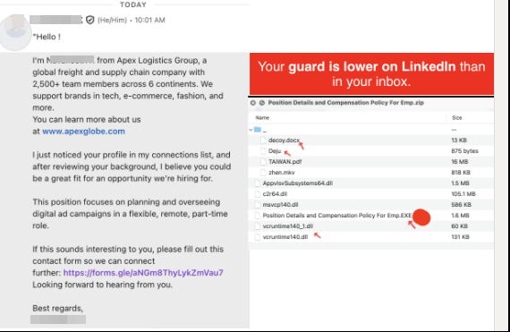
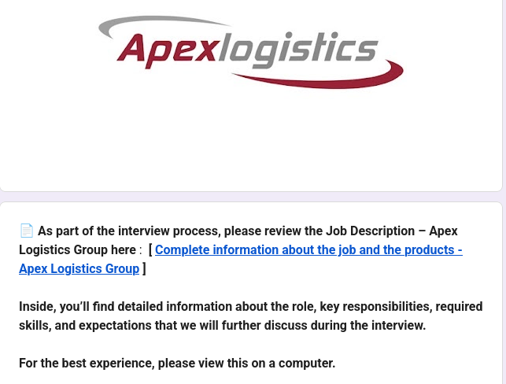
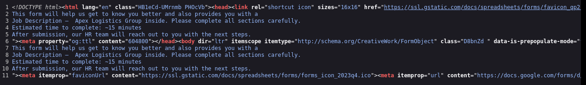
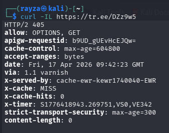
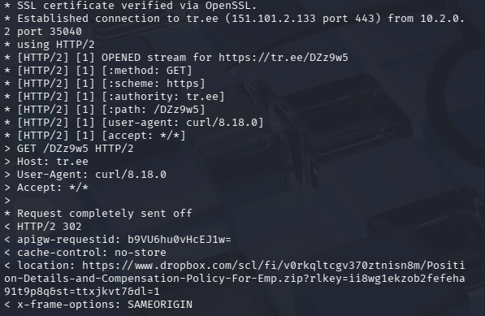
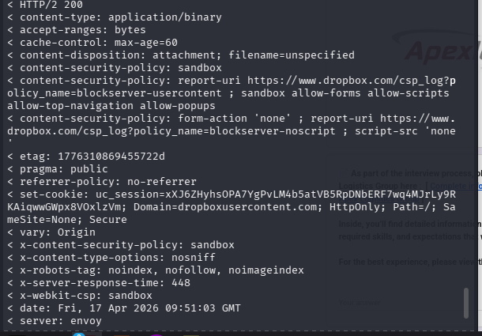
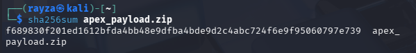
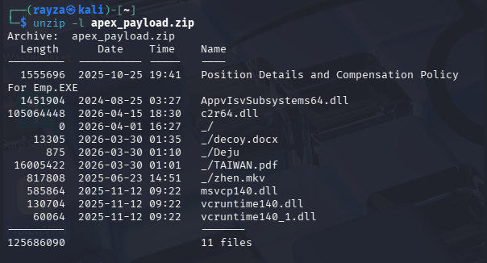
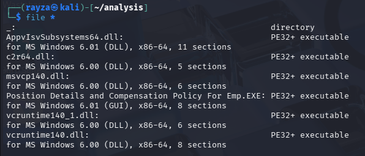
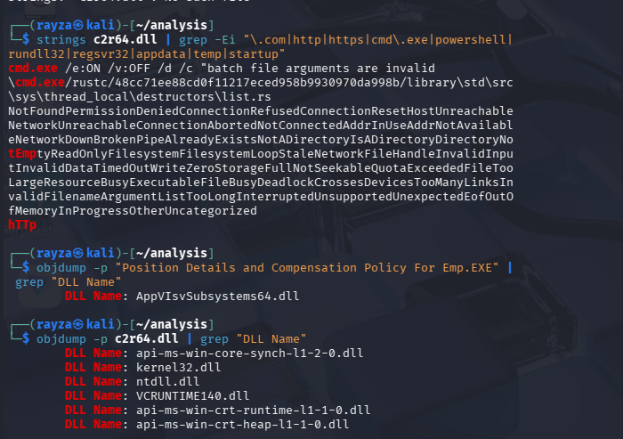

# Apex Logistics Recruitment Lure Investigation  
**Date:** 17 April 2026  

---

## Introduction

I came across this while casually scrolling LinkedIn. This post intrigued me, so I decided to dig into it and see what was actually behind it.

The post described a recruitment-style lure using a Google Form that supposedly led to a suspicious payload. Rather than just take that at face value, I wanted to follow the chain myself and see what was actually happening behind it.

This write-up documents that process.

---

## Executive Summary

A recruitment-themed lure was identified using:

- A convincing Google Form as the entry point  
- A shortened URL (`tr.ee`) to obscure the destination  
- A Dropbox-hosted ZIP archive delivering a payload  

Static analysis of the archive revealed:

- An executable disguised as a job-related document  
- Multiple DLL files, including one commonly abused in sideloading  
- Several decoy files (PDF, DOCX, video)  

The structure is consistent with DLL sideloading techniques combined with social engineering.

No files were executed during this investigation.

---

## Initial Discovery

This started from a LinkedIn post discussing a suspicious recruitment message.

At this stage:

- The company mentioned (Apex Logistics) appears legitimate  
- Their branding is likely being used for credibility  
- The sender account shown may not be the attacker (could be compromised)

So the focus remained on technical behaviour, not attribution.

---

## Google Form (Trust Layer)

The link led to a Google Form that looked fairly convincing.

Nothing immediately stood out:

- Branding looked consistent  
- Questions were typical for a job application  
- Overall flow felt legitimate  

However, one detail stood out:

A link offering “complete information about the job”.

That became the pivot point.

---

## Hidden Link and Redirect Chain

The link did not go directly to a company site. Instead, it used a shortened URL:

`tr.ee/DZz***`

The destination wasn’t obvious from the form itself and was not visible in the page source.

I then followed the link using `curl` to trace where it actually led.

Initial response:

Following the redirects revealed the actual destination:

Flow:

- Google Form  
- tr.ee shortlink  
- Dropbox  

This confirmed the form wasn’t just collecting data, it was part of a delivery chain.

---

## Payload Delivery

The Dropbox link resulted in a direct binary download:

Key observations:

- Delivered as application/binary  
- File size ~122MB  

This is far larger than a legitimate job document.

---

## Payload Acquisition and Hashing

The archive was downloaded in a controlled environment and hashed.

### File Hash

f689830f201ed1612bfda4bb48e9dfba4bde9d2c4abc724f6e9f95060797e739

This provides a unique identifier for the sample and allows for consistent tracking or comparison.

The file hash was checked against VirusTotal, and no matches were found at the time of analysis.

This may indicate the sample has not yet been widely submitted or detected. Despite the lack of detections, the structure of the payload and its delivery method remain strong indicators of malicious intent.

Low or zero detections are not uncommon with newer or less widely distributed samples, particularly those delivered through targeted or short-lived campaigns.

---

## Archive Contents

Listing the contents of the ZIP revealed the real structure:

Files included:

- Position Details and Compensation Policy For Emp.EXE  
- AppvIsvSubsystems64.dll  
- c2r64.dll  
- msvcp140.dll  
- vcruntime140.dll  
- vcruntime140_1.dll  
- decoy.docx  
- TAIWAN.pdf  
- zhen.mkv  

This is not consistent with a legitimate job pack.

Instead, it shows:

- An executable disguised as a document  
- Supporting DLLs  
- Multiple decoy files to distract the user  

---

## Static File Analysis

Basic inspection confirmed the key files were Windows PE binaries.

---

## DLL Sideloading Indicators

Further inspection of the executable showed:

DLL Name: AppvIsvSubsystems64.dll

This is important because:

- AppvIsvSubsystems64.dll is a legitimate Windows DLL name  
- It is commonly abused in DLL sideloading attacks  

The executable is designed to load this DLL from its local directory.

The combination of a large DLL, minimal readable strings, and reliance on DLL loading behaviour suggests the executable is acting primarily as a loader rather than containing the full payload logic itself.

---

## Additional Observations

- c2r64.dll is unusually large (~100MB), suggesting it may contain the core payload  
- Strings analysis revealed references such as cmd.exe and http  
- No clear command-and-control domains were visible  

Strings didn’t reveal anything meaningful, and combined with the unusually large DLL size (~100MB), this suggests the payload is likely packed or obfuscated rather than a simple, easily inspectable binary.

---

## Likely Execution Flow

Based on the observed structure, this attack relies on user interaction rather than automatic execution:

1. User clicks the link provided in the message
2. Redirect chain leads to a Dropbox-hosted ZIP file
3. The file is downloaded, either automatically or via user prompt
4. User extracts the archive to view its contents
5. The archive contains a file named to resemble a legitimate document (EXE disguised as job details)
6. User executes the file, believing it to be safe
7. The executable loads a local DLL (AppvIsvSubsystems64.dll)
8. The DLL executes the actual payload
9. A decoy file may be opened to reduce suspicion

This aligns with common DLL sideloading techniques, combined with social engineering to drive execution.

The attack does not rely on exploitation of the browser or operating system, but instead on convincing the user to manually execute the payload.

---

## Attribution Considerations

There is no evidence that Apex Logistics is involved.

Their name appears to be used purely for credibility.

Similarly, the sender account shown in the original LinkedIn post may not be the attacker.

This appears to be a case of brand impersonation combined with a staged delivery chain.

---

## Responsible Disclosure

The relevant hosting providers have been notified as part of responsible disclosure.

- Dropbox (payload hosting)  
- Google (Google Forms abuse)

---

## Lessons Learned

- Convincing attacks don’t need to look obviously malicious  
- Trusted platforms like Google Forms and Dropbox are effective delivery layers  
- Shortlinks hide important context and should always be followed  
- Archive structure alone can reveal a lot without execution  
- Lack of visible strings does not mean a payload is harmless  

---

## Final Thoughts

This started as a random LinkedIn post and turned into a solid real-world investigation.

What stood out was how cleanly the attack chain was structured:

- A believable entry point  
- A hidden transition layer  
- A trusted hosting platform  
- A payload designed to blend in  

Even without executing the file, the intent behind the structure is clear.

I will be continuing this analysis further, focusing on deeper inspection of the payload and observing its behaviour through controlled dynamic testing. This should give a clearer picture of how it actually operates beyond static analysis.

---
